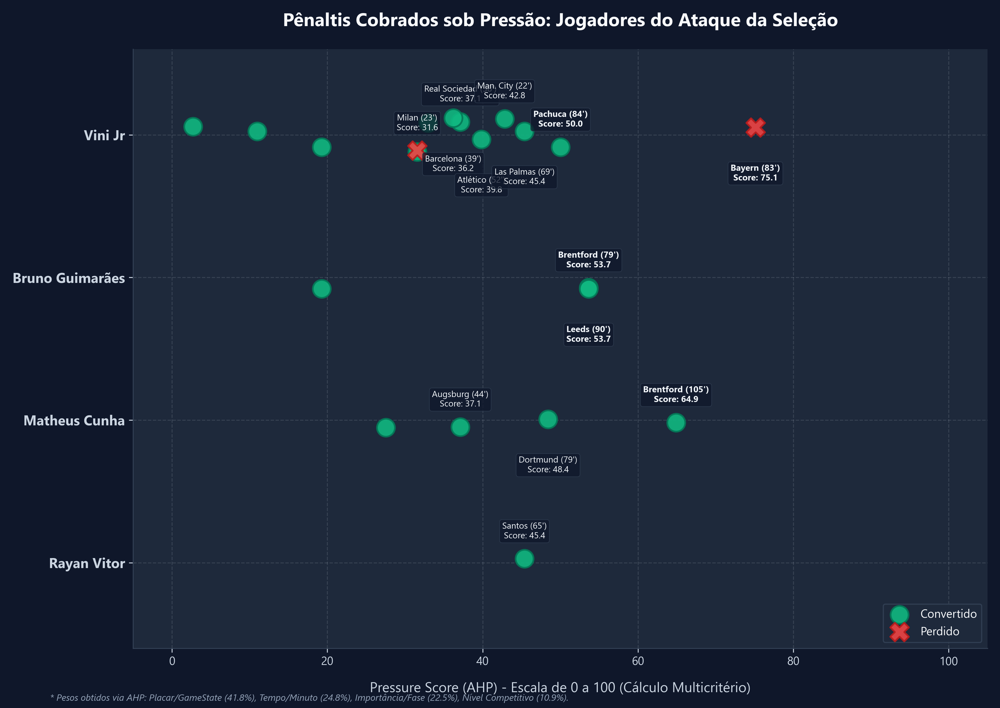

# ⚽ Clutch Penalty Index (CPI) & Penalty Pressure Score Analysis

This sports analytics project applies data science and decision-making methodology to quantify psychological pressure in soccer penalty kicks. We analyze the career penalty statistics of the starting line-up of the Brazilian national team, using **AHP (Analytic Hierarchy Process)** to calculate a **Pressure Score** and the **Clutch Penalty Index (CPI)**.

The project is inspired by sports psychology literature (e.g., Geir Jordet's research on "choking under pressure" in penalties) and demonstrates how contextualizing raw data is critical for decision-making.

---

## 📈 Analysis Overview

Below is the visual distribution of penalty kicks taken by the Brazilian attack, weighted by the AHP-derived Pressure Score (0-100 scale):



### Summary of Pre-Match Statistics & CPI

Before the 2026 World Cup Round of 16 match against Norway, the career penalty records in regular time for the starting XI were:

| Player | Position | Penalties Taken | Converted | Missed | Avg Pressure (AHP) | CPI (AHP) |
| :--- | :--- | :---: | :---: | :---: | :---: | :---: |
| **Matheus Cunha** | Forward | 4 | 4 | 0 | 44.5 | **1.000** |
| **Bruno Guimarães** | Midfielder | 3 | 3 | 0 | 42.2 | **1.000** |
| **Rayan Vitor** | Forward | 1 | 1 | 0 | 45.4 | **1.000** |
| **Vini Jr** | Forward | 13 | 11 | 2 | 35.0 | **0.766** |

*Note: All other starting players (Alisson, Douglas Santos, Danilo, Marquinhos, Gabriel Magalhães, Casemiro, Martinelli) had 0 regular-time penalty attempts (CPI: N/A).*

---

## 🔬 Methodology

### 1. Feature Engineering
We extract 8 context variables from each penalty kick, grouped into 4 dimensions:
*   **Competitive Level:** Domestic League (+1), Continental Cup (+2), National Team (+3), Derby/Clássico (+1).
*   **Match Stage:** Groups/Regular Season (+0), Round of 16 (+1), Quarterfinals (+2), Semifinals (+3), Finals (+4), Knockout Match (+2).
*   **Score State (Game State):** Tied (+2), Team Losing (+3), Goal importance (Empata: +2, Coloca na frente: +3, Amplia: +0, Diminui: +1).
*   **Temporal Pressure:** 0'-30' (+0), 31'-60' (+1), 61'-75' (+2), 76'-90'+ (+3).

### 2. AHP Weight Derivation
Rather than using arbitrary weights, we apply **AHP (Analytic Hierarchy Process)** to compare the 4 dimensions parewise. This yields the following mathematical weights:
*   **Score State (Game State):** `41.8%`
*   **Temporal Pressure:** `24.8%`
*   **Match Stage:** `22.5%`
*   **Competitive Level:** `10.9%`

### 3. Clutch Penalty Index (CPI)
$$\text{CPI} = \frac{\sum \text{AHP Pressure Score of Converted Penalties}}{\sum \text{AHP Pressure Score of All Penalties}}$$

---

## 📂 Project Structure

```
├── Analise_Indice_Penalti_Original.xlsx    # Raw input spreadsheet
├── Analise_Indice_Penalti_Enriquecido.xlsx  # Processed output spreadsheet
├── enrich_dataset.py                        # Data cleaning and feature engineering
├── plot_enriched_penalties.py               # Spaced chart generator (matplotlib)
├── README.md                                # Project overview
└── docs/                                    # Internal documents and preview assets
    ├── pressure_analysis.png                # Output chart
    ├── linkedin_preview.html                # HTML simulation of the LinkedIn post
    ├── avatar.jpg                           # Preview profile picture
    ├── analise_pressao_penaltis.md          # Draft LinkedIn post
    └── metodologia_ahp_cpi.md               # Mathematical AHP derivation
```

---

## 🚀 How to Run the Project

### 1. Requirements
Ensure you have the required Python libraries installed:
```bash
pip install pandas openpyxl matplotlib numpy
```

### 2. Data Processing & Plotting
Run the data enrichment script followed by the plotting script:
```bash
# Clean, calculate AHP/CPI, and output Enriched Excel
python enrich_dataset.py

# Generate the spaced scatter plot in docs/
python plot_enriched_penalties.py
```
